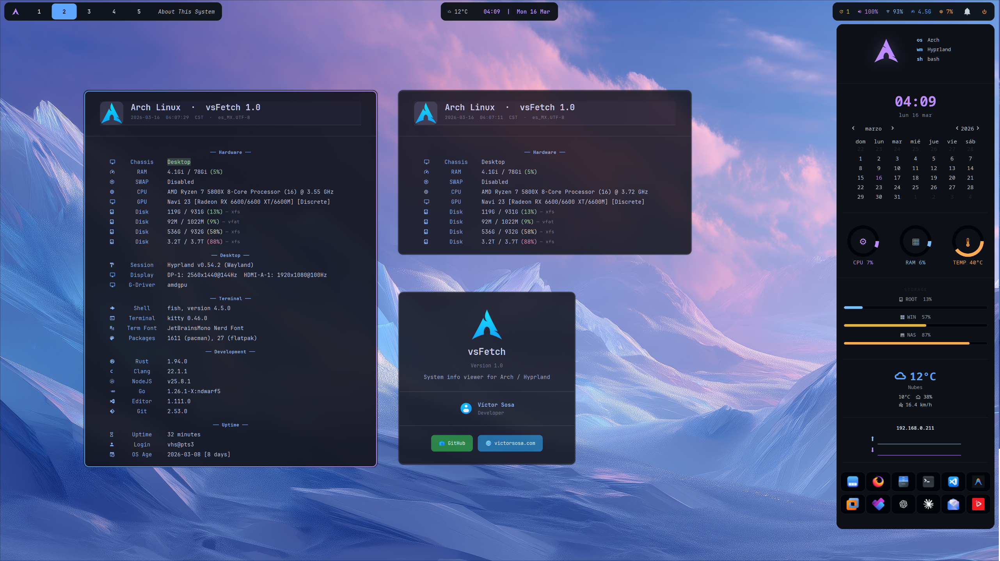

# vsFetch

A graphical system info viewer for Linux — inspired by `fastfetch`, built with Python + GTK3.
Think of it as an "About This Computer" panel for your desktop.

[](https://aur.archlinux.org/packages/vsfetch-git)
[](LICENSE)



---

## Features

- Displays system info in sections: **Hardware, Desktop, Terminal, Development, Uptime**
- Auto-detects OS and loads the matching distributor logo (via Papirus icon theme)
- Color-coded disk/RAM usage (green / yellow / red)
- `--mini` mode: shows only the header + Hardware section
- `--version` mode: About panel with author info and links

---

## Usage

```bash
vsfetch             # full view
vsfetch --mini      # hardware only
vsfetch --version   # about / credits
```

---

## Requirements

- Python 3
- GTK3 (`python-gobject`)
- `hyprctl` (for Hyprland monitor info)
- [Papirus Icon Theme](https://github.com/PapirusDevelopmentTeam/papirus-icon-theme) (optional, for OS logo)
- [JetBrainsMono Nerd Font](https://www.nerdfonts.com/) (optional, for icons in labels)

### Arch Linux

```bash
sudo pacman -S python-gobject papirus-icon-theme ttf-jetbrains-mono-nerd
```

### Ubuntu / Debian

```bash
sudo apt install python3-gi python3-gi-cairo gir1.2-gtk-3.0 papirus-icon-theme
```

> For Nerd Fonts on Ubuntu, download manually from [nerdfonts.com](https://www.nerdfonts.com/font-downloads) and place in `~/.local/share/fonts/`, then run `fc-cache -fv`.

### Fedora

```bash
sudo dnf install python3-gobject gtk3 papirus-icon-theme
```

> For Nerd Fonts on Fedora:
> ```bash
> sudo dnf install jetbrains-mono-fonts-all
> ```
> Then install the Nerd Font variant manually from [nerdfonts.com](https://www.nerdfonts.com/font-downloads).

---

## Install

### Arch Linux — AUR

```bash
yay -S vsfetch-git
```

Or manually with any AUR helper:
```bash
paru -S vsfetch-git
```

### Manual

```bash
git clone https://github.com/victorsosaMx/vsFetch.git
cd vsFetch
chmod +x vsfetch
cp vsfetch ~/.local/bin/vsfetch
```

### Hyprland — float window rule (optional)

Add to your `~/.config/hypr/modules/rules.conf`:

```
windowrule {
    name = vsfetch
    match:class = arch-about
    float = yes
    size = 700 700
    center = yes
}
```

---

## Credits

- **[fastfetch](https://github.com/fastfetch-cli/fastfetch)** — inspiration for the layout and system info approach
- **[Papirus Icon Theme](https://github.com/PapirusDevelopmentTeam/papirus-icon-theme)** by Alexey Varfolomeev — distributor logos used in the header
- **[Catppuccin Mocha](https://github.com/catppuccin/catppuccin)** — color palette used throughout the UI
- **[Nerd Fonts](https://www.nerdfonts.com/)** — icons used in section labels

---

## License

This project is licensed under the **MIT License** — see the [LICENSE](LICENSE) file for details.

**In short:** You're free to use, modify, and distribute this software for any purpose (commercial or personal), as long as you include the original license and copyright notice.

---

## Author

**Víctor Sosa**
🌐 [victorsosa.com](https://victorsosa.com/)
🐙 [github.com/victorsosaMx](https://github.com/victorsosaMx)
