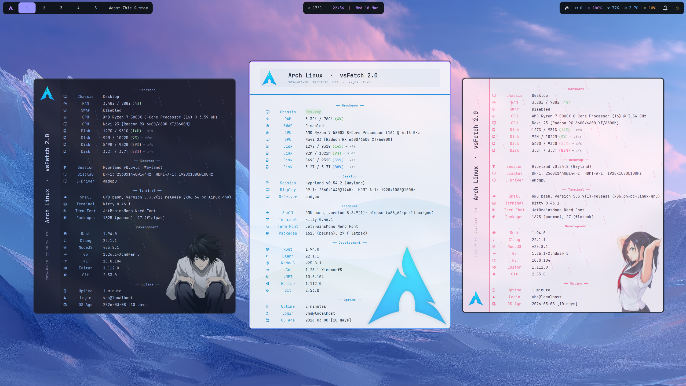
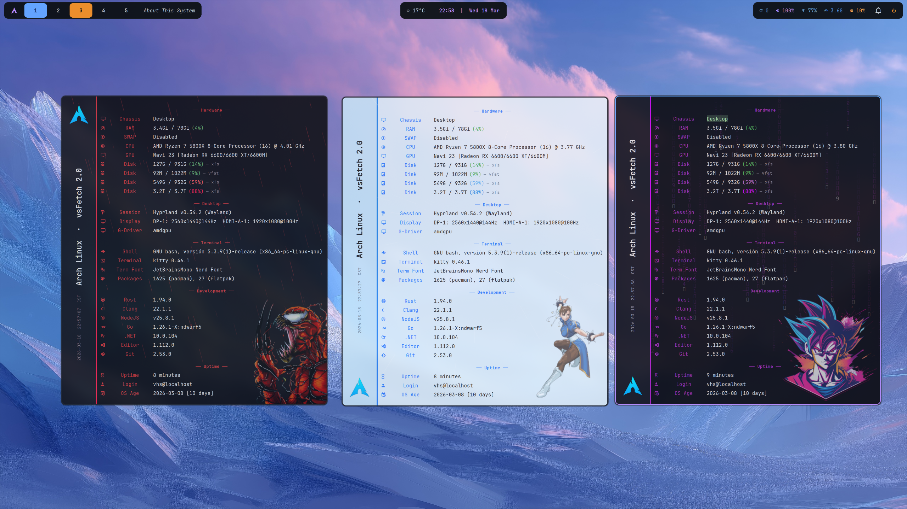
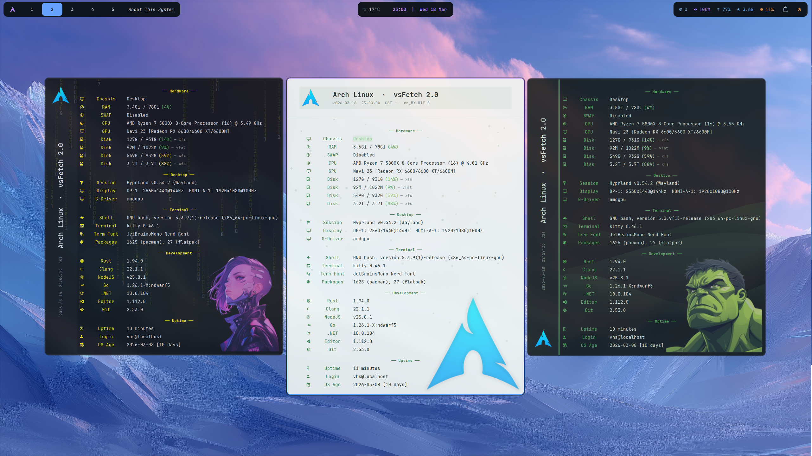
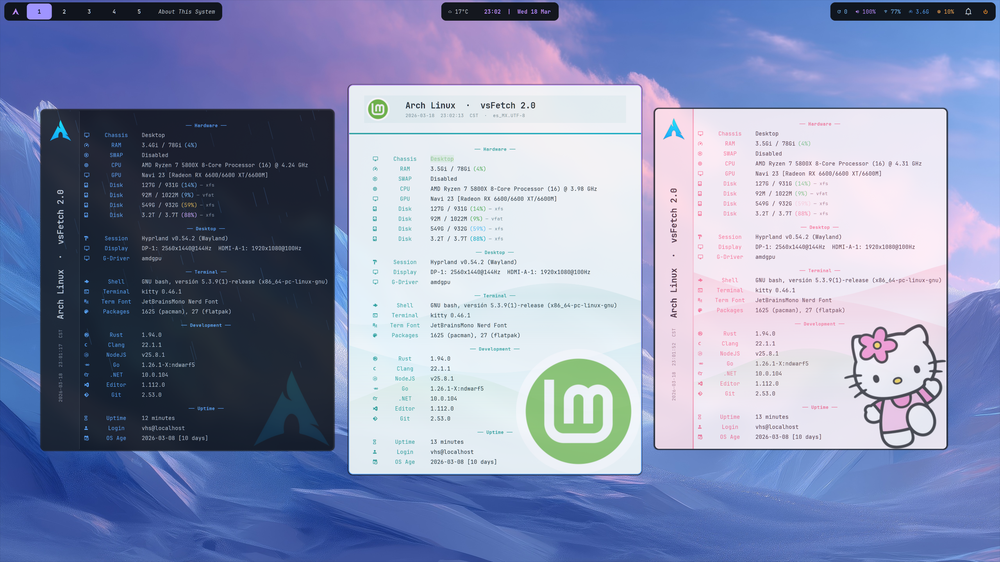
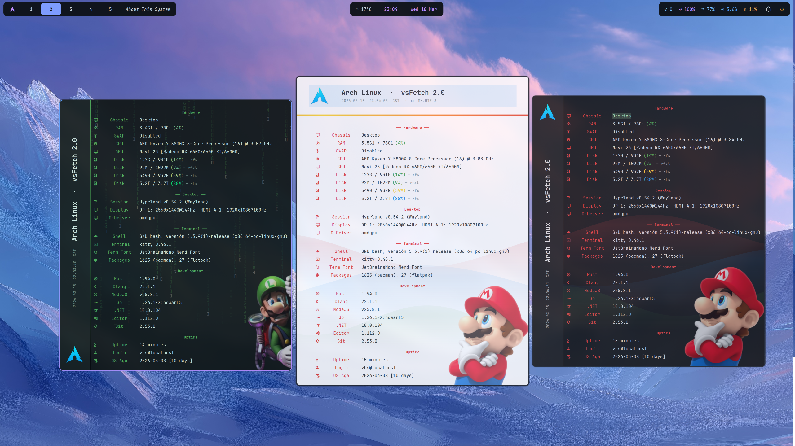
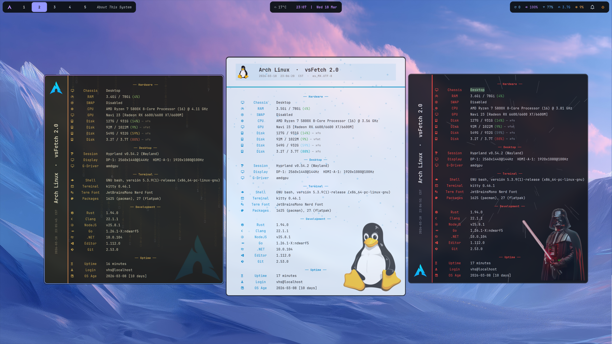

# vsFetch

A graphical system info viewer for Linux — inspired by `fastfetch`, built with Python + GTK3.
Think of it as an "About This Computer" panel for your desktop, with live background animations.

[](https://aur.archlinux.org/packages/vsfetch-git)
[](https://aur.archlinux.org/packages/vsfetch)
[](LICENSE)








---

## Features

- System info in sections: **Hardware, Desktop, Terminal, Development, Uptime**
- Two layouts: **top header** (classic) or **left sidebar** (vertical)
- **5 background animations**: rain, snow, matrix, aurora, warp — scoped to body or full window
- **Background image overlay** — drop any image in the bottom corner with adjustable opacity; falls back to the distro logo automatically
- **Animated gradient bar** — 2-color scrolling separator between header and content
- Auto-detects OS and loads the matching distributor logo (via Papirus icon theme)
- Color-coded disk/RAM usage (green / yellow / red)
- `--mini` mode: header + Hardware section only
- `--version` mode: About panel with author info and links
- Fully configurable via a single `~/.config/vsfetch/config.json`
- **Multi-distro**: detects shell, terminal, font, packages and OS age across Arch, Debian, Fedora, openSUSE, Alpine and more

---

## Usage

```bash
vsfetch                              # full view
vsfetch --mini                       # hardware only
vsfetch --version                    # about / credits
vsfetch --config ~/themes/nord.json  # load a specific config (extends ignored)
```

---

## Requirements

- Python 3
- GTK3 (`python-gobject`)
- `python-cairo`
- [Papirus Icon Theme](https://github.com/PapirusDevelopmentTeam/papirus-icon-theme) (optional, for OS logo)
- [JetBrainsMono Nerd Font](https://www.nerdfonts.com/) (optional, for icons in labels)

### Arch Linux

```bash
sudo pacman -S python-gobject python-cairo papirus-icon-theme ttf-jetbrains-mono-nerd
```

### Ubuntu / Debian

```bash
sudo apt install python3-gi python3-gi-cairo gir1.2-gtk-3.0 papirus-icon-theme
```

> For Nerd Fonts on Ubuntu, download manually from [nerdfonts.com](https://www.nerdfonts.com/font-downloads) and place in `~/.local/share/fonts/`, then run `fc-cache -fv`.

### Fedora

```bash
sudo dnf install python3-gobject python3-cairo gtk3 papirus-icon-theme
```

---

## Install

### Arch Linux — AUR

Stable release:
```bash
yay -S vsfetch
```

Development version (latest commit):
```bash
yay -S vsfetch-git
```

### Manual

```bash
git clone https://github.com/victorsosaMx/vsFetch.git
cd vsFetch
chmod +x vsfetch
cp vsfetch ~/.local/bin/vsfetch
```

### Hyprland — float window rule (optional)

Add to your `~/.config/hypr/modules/rules.conf`:

```
windowrule {
    name = vsfetch
    match:class = vsfetch
    float = yes
    size = 700 700
    center = yes
}
```

---

## Configuration

vsFetch reads `~/.config/vsfetch/config.json` on startup. If the file doesn't exist, built-in defaults (Catppuccin Mocha) are used. **Partial configs are supported** — only the keys you specify override the defaults.

```bash
mkdir -p ~/.config/vsfetch
cp /usr/share/doc/vsfetch-git/config.json.example ~/.config/vsfetch/config.json
```

### Reference

| Key | Type | Default | Description |
|-----|------|---------|-------------|
| `font` | string | `"JetBrainsMono Nerd Font"` | UI font family |
| `default_mode` | string | `"full"` | Startup mode: `"full"`, `"mini"`, `"version"`. CLI flags override. |
| `chassis` | string | `""` | Override chassis label. Empty = auto-detect from DMI. |
| `layout` | string | `"top"` | Header position: `"top"` or `"left"` (sidebar). |
| `extends` | string | `""` | Path to a theme config file. See [Theme inheritance](#theme-inheritance) below. |

---

## Theme inheritance

vsFetch has a two-layer config system designed so you can switch themes safely **without ever touching your personal settings**.

### How it works

```
DEFAULTS  →  config.json (your base)  →  extends file (active theme, wins everything)
```

- **`config.json`** is your personal file. Put things that belong to your machine here: your background image path, your preferred layout, your sections order.
- **The `extends` file** is the active theme. Anything it defines overrides `config.json`. If it defines `palette`, those colors win. If it defines `animation`, that animation runs.
- **DEFAULTS** are the built-in fallback. If neither file defines a key, the default is used.
- **Only `config.json` can use `extends`** — theme files cannot point to another file. One level, no chains, no loops.

### Example setup

```json
// ~/.config/vsfetch/config.json  — your personal base, rarely changes
{
  "extends": "~/.config/vsfetch/themes/forest.json",
  "layout": "left",
  "bg_image": { "path": "~/wallpapers/my-image.png", "opacity": 0.6 },
  "sections": ["hardware", "desktop", "terminal", "development", "uptime"]
}
```

```json
// ~/.config/vsfetch/themes/forest.json  — the active theme
{
  "palette": {
    "bg": "#1e2718",
    "bg_header": "#232d1c",
    "accent": "#a7c080",
    "ok": "#83c092",
    "mid": "#dbbc7f",
    "hi": "#e67e80"
  },
  "animation": { "enabled": true, "type": "aurora", "opacity": 0.2 }
}
```

To switch themes, just change the `extends` line in `config.json`. Your layout, image, and sections stay untouched.

### What the theme file can and cannot override

| Key | Theme can override it? | Notes |
|-----|------------------------|-------|
| `palette` (any key) | Yes | Define only the colors you want to change — unset keys fall back to `config.json` or DEFAULTS |
| `animation` (any key) | Yes | Same — partial override is supported |
| `font_sizes`, `logo`, `window`, `gradient_bar`, `bg_image` | Yes | Partial override supported |
| `font`, `layout`, `default_mode`, `chassis`, `sections`, `dev_tools` | Yes | Full replacement — if the theme sets it, it wins |

> **Important:** these are all partial merges at the sub-object level. If your theme sets `"palette": { "bg": "#000" }`, only `bg` changes — all other palette colors still come from `config.json` or DEFAULTS. The theme does **not** need to define every key to take effect.

### Testing a theme without touching your config

Use `--config` to load a theme file directly. In this mode `extends` is ignored — you get exactly what's in that file plus built-in defaults:

```bash
vsfetch --config ~/.config/vsfetch/themes/forest.json
vsfetch --config ~/Downloads/nord-test.json --mini
```

This is safe for experimentation: your `config.json` and its `extends` setting are never read.

#### `palette`

| Key | Default | Used in |
|-----|---------|---------|
| `bg` | `#13131c` | Window background |
| `bg_header` | `#181825` | Header / sidebar background |
| `border` | `#313244` | Separators |
| `text` | `#cdd6f4` | Primary text, values |
| `text_dim` | `#6c7086` | Secondary text, timestamps |
| `text_mid` | `#a6adc8` | Tertiary text |
| `accent` | `#89b4fa` | Section titles, icons, keys |
| `ok` | `#a6e3a1` | Usage < 50% |
| `mid` | `#f9e2af` | Usage 50–79% |
| `hi` | `#f38ba8` | Usage ≥ 80% |
| `btn_github` | `#238636` | GitHub button |
| `btn_github_hover` | `#2ea043` | GitHub button hover |
| `btn_web` | `#1d6fa5` | Web button |
| `btn_web_hover` | `#2484c1` | Web button hover |

#### `font_sizes`

| Key | Default | Used in |
|-----|---------|---------|
| `title` | `20` | OS name in header |
| `body` | `13` | Keys, values, icons |
| `small` | `11` | Section labels, timestamps |

#### `logo`

| Key | Default | Description |
|-----|---------|-------------|
| `size` | `56` | Logo pixel size |
| `override` | `""` | File path (`~/logo.png`) or icon theme name. Empty = auto-detect. |
| `sidebar_position` | `"bottom"` | Logo position in left layout: `"top"` or `"bottom"`. |

#### `window`

| Key | Default | Description |
|-----|---------|-------------|
| `width` | `700` | Window width |
| `height_mini` | `380` | Height in mini mode |
| `height_full` | `680` | Height in full mode |

#### `gradient_bar`

Animated 2-color scrolling bar between header and content.

| Key | Default | Description |
|-----|---------|-------------|
| `enabled` | `false` | Enable gradient bar |
| `color_a` | `#89b4fa` | First color |
| `color_b` | `#f38ba8` | Second color |

#### `bg_image`

Image overlaid in the bottom-right corner of the window.

| Key | Default | Description |
|-----|---------|-------------|
| `enabled` | `true` | Show background image. Set to `false` to disable completely — no image, no distro logo fallback. |
| `path` | `""` | Path to image file. Empty = auto-uses distro logo from Papirus. |
| `size` | `200` | Rendered size in pixels (square). Source image can be any size. |
| `opacity` | `0.15` | Transparency (0.0–1.0) |

#### `animation`

Live background animation rendered behind the content.

| Key | Default | Description |
|-----|---------|-------------|
| `enabled` | `false` | Enable animation |
| `type` | `"rain"` | Animation type: `"rain"`, `"snow"`, `"matrix"`, `"aurora"`, `"warp"` |
| `scope` | `"body"` | Coverage: `"body"` (below header) or `"full"` (entire window) |
| `color` | `""` | Primary color hex. Empty = uses `accent` from palette (or white for snow/warp). |
| `opacity` | `0.25` | Animation opacity (0.0–1.0) |
| `speed` | `1.0` | Speed multiplier |
| `drops` | `80` | Particle count (rain, snow, warp). Not used by aurora. |

**Animation types:**

| Type | Description |
|------|-------------|
| `rain` | Diagonal streaks falling at 15°, uses `accent` color |
| `snow` | Circular flakes with sinusoidal drift, white by default |
| `matrix` | Falling katakana columns with bright head and fading trail |
| `aurora` | Undulating sine bands using `accent`, `hi`, and `ok` palette colors |
| `warp` | Stars radiating from center, accelerating outward (starfield) |

#### `sections`

Controls which sections are visible and their order in full mode.

```json
"sections": ["hardware", "desktop", "terminal", "development", "uptime"]
```

#### `dev_tools`

List of tools shown in the Development section. If a command returns empty or `N/A`, that row is hidden automatically.

> **Note:** `dev_tools` is a full replacement — if you define it in a theme or config, it replaces the entire list. To show only one tool, define only one entry.

```json
"dev_tools": [
  { "icon": "󱘗", "name": "Rust",   "cmd": "rustc --version 2>/dev/null | awk '{print $2}'" },
  { "icon": "󰊢", "name": "Git",    "cmd": "git --version 2>/dev/null | awk '{print $3}'" },
  { "icon": "󰌠", "name": "Python", "cmd": "python3 --version 2>/dev/null | awk '{print $2}'" }
]
```

#### `themes/`

The repo includes 21 ready-made theme files in the `themes/` folder. Each file is fully self-contained — every config key is explicitly defined so there is no guessing about inherited values.

| Theme | Style | Animation | Layout |
|-------|-------|-----------|--------|
| `config_Catppuccing(default)` | Dark, blue-purple | Rain | Left |
| `config_Anime` | Light pink | Rain (pink, fast) | Left |
| `config_Archligth` | Light blue (Arch) | Aurora | Top |
| `config_Carnage` | Dark red | Rain (red) | Left |
| `config_ChungLi` | Light blue | Warp | Left |
| `config_CyberP` | Dark purple cyberpunk | Matrix (purple) | Left |
| `config_CyberY` | Dark yellow cyberpunk | Matrix (yellow) | Left |
| `config_forest` | Dark green | Aurora | Left |
| `config_forest_dayligth` | Light green | Snow (gentle) | Top |
| `config_github-dark-colorblind` | Dark blue (GitHub colorblind) | Rain (full) | Left |
| `config_HellowKitty` | Light pink pastel | Snow (pink) | Left |
| `config_IceMint` | Light teal | Aurora | Top |
| `config_Luigi_Dark` | Dark green | Matrix (green) | Left |
| `config_Mario` | Light red/blue | Warp | Top |
| `config_Mario_Dark` | Dark red/yellow | Warp | Left |
| `config_retroPaper` | Dark sepia | Matrix (golden) | Top |
| `config_Tux` | Light blue | Snow (blue, dense) | Top |
| `config_Ubuntu` | Light orange | Rain (orange) | Left |
| `config_Ubuntu_Yaru_Dark` | Dark orange | Aurora | Left |
| `config_Ubuntu_Yaru_Light` | Light orange | Snow | Left |
| `config_Vader` | Very dark, red | Warp (full) | Left |

Test any theme directly:
```bash
vsfetch --config ~/.config/vsfetch/themes/config_Vader.json
```

Activate a theme via `extends` in your personal config:
```json
{
  "extends": "~/.config/vsfetch/themes/config_Vader.json",
  "bg_image": { "path": "~/my-image.png" }
}
```

---

## Credits

- **[fastfetch](https://github.com/fastfetch-cli/fastfetch)** — inspiration for the layout and system info approach
- **[Papirus Icon Theme](https://github.com/PapirusDevelopmentTeam/papirus-icon-theme)** by Alexey Varfolomeev — distributor logos
- **[Catppuccin Mocha](https://github.com/catppuccin/catppuccin)** — default color palette
- **[Nerd Fonts](https://www.nerdfonts.com/)** — icons in section labels

---

## License

This project is licensed under the **MIT License** — see the [LICENSE](LICENSE) file for details.

**In short:** You're free to use, modify, and distribute this software for any purpose (commercial or personal), as long as you include the original license and copyright notice.

---

## Author

**Víctor Sosa**
🌐 [victorsosa.com](https://victorsosa.com/)
🐙 [github.com/victorsosaMx](https://github.com/victorsosaMx)
